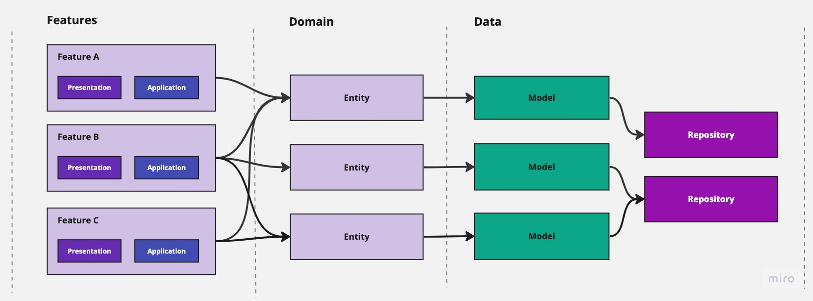

# Mobile

This section is on how to start running the project on devices or simulators.

## Running mobile apps

```bash
# Check emulator with flutter emulators
$ flutter run # please note that there must be 1 Emulator listed and run
```

## Running with Flavors

**_Flavors_** in Android are used to create different app versions. It can be free or paid, etc. This enables us to create multiple variants of the app using the same code base. In iOS, this is called as **_Scheme_**.

In Yanmii Wallet, flavors are divided by its development environments. So it can be either development, staging (UAT), or production. Each of these flavor produces different binary variants with different Application IDs (for Android) or Bundle IDs (for iOS).

The purpose of this separation is to make it easier to testers, product managers, or stakeholders to test the app with fully isolated environment and in order for them not to get confused on which environment of the app the are currently on.

For Android, we use application IDs:

1. `com.yanmi.wallet.dev` for development
2. `com.yanmi.wallet.stg` for staging (UAT)
3. `com.yanmi.wallet` for production

As for iOS, we use Bundle IDs:

1. `com.yanmii.wallet.dev` for development
2. `com.yanmii.wallet.stg` for staging (UAT)
3. `com.yanmii.wallet` for production

Or if you want to target a specific flavor.

For development:

```bash
flutter run --flavor dev --dart-define=ENV=DEV --dart-define=API_URL=''
```

For staging:

```bash
flutter run --flavor stg --dart-define=ENV=STG --dart-define=API_URL=''
```

For production

```bash
flutter run --flavor prod --dart-define=ENV=PROD --dart-define=API_URL=''
```

## VS Code's Launch Configuration

If you want to run through VS Code configucation, then you have to add configurations like these

```
{
    "version": "0.2.0",
    "configurations": [
        {
            "name": "Dev",
            "type": "dart",
            "request": "launch",
            "program": "lib/main.dart",
            "args": [
                "--dart-define=API_URL=",
                "--dart-define=ENV=DEV",
                "--flavor=dev"
            ]
        },
        {
            "name": "Staging",
            "type": "dart",
            "request": "launch",
            "program": "lib/main.dart",
            "args": [
                "--dart-define=API_URL=",
                "--dart-define=ENV=STG",
                "--flavor=stg"
            ]
        },
        {
            "name": "Prod",
            "type": "dart",
            "request": "launch",
            "program": "lib/main.dart",
            "args": [
                "--dart-define=API_URL",
                "--dart-define=ENV=PROD",
                "--flavor=prod"
            ]
        },
    ]
}
```

Pretty much all of the multiple flavors/schemes setup is taken from [Build flavors in Flutter (Android and iOS) with different Firebase projects per flavor](https://medium.com/@animeshjain/build-flavors-in-flutter-android-and-ios-with-different-firebase-projects-per-flavor-27c5c5dac10b)

# Project Architecture

The project's structure combines the Feature-First and Layer First approach. Feature-First means the directories of features are placed on top of layers directory. Every single feature has to have their own application, presentation, domain, and data layers underneath which each of them represents application layer. While Layer-First means otherwise.

## Entry Points

This project has single entry point as what per defined in `main.dart`. Anything specific to each environment is defined as variables in `--dart-define`.

All of the firebase projects being used by their respective main files are located under `lib/firebase` folder.

As for how to run or build the app with specific target, please refer [Running with Flavors](#running-with-flavors).

## Folder Layout

```
    # Root Project
    .
    ├── android
    │   ├── app
    │   │   ├── src
    │   │   │   ├── google-services.json
    ├── assets
    │   ├── fonts
    │   ├── images
    │   ├── translations
    ├── ios
    │   ├── config
    │   │   ├── dev
    │   │   │   ├── GoogleServices-info.plist
    │   │   ├── prod
    │   │   │   ├── GoogleServices-info.plist
    │   │   ├── stg
    │   │   │   ├── GoogleServices-info.plist
    ├── lib
    │   ├── gen                         # All generated codes go here
    │   └── src                         # All the source code here
    │   │   ├── app
    │   │   │   ├── config              # Flavor and app config
    │   │   │   ├── firebase            # Store Firebase options
    │   │   │   ├── theme               # App theme, typography, colors, etc
    │   │   ├── components              # Widgets used in many places accross the app.
    │   │   ├── constants               # Constants, extras keys, etc,
    │   │   ├── features
    │   │   │   ├── auth
    │   │   │   │   ├── application     # Feature services
    │   │   │   │   ├── presentation    # UI and the controllers and states
    │   │   │   ├── main
    │   │   │   │   ├── application
    │   │   │   │   ├── presentation
    │   │   ├── data
    │   │   │   ├── repositories        # shared repositories
    │   │   │   ├── models              # shared DTO models
    │   │   ├── domain
    │   │   │   ├── entities            # shared entity models
    │   │   ├── localization            # Generated CodeGen loader, LocaleKeys, etc
    │   │   ├── routing                 # Routes using Go Router
    │   │   ├── services                # Local and remote data handling service
    │   │   ├── utils                   # Extensions, validators, etc.
    └── test

```

### Network Service

This service is located in `lib/service/network` folder. This folder includes all classes related with network connections.

- `DioClient` class is responsible for handling core network connection job such as setting header, parameters, certificate. The bearer token which is saved once the user is logged in is also obtained inside this class.
- `ApiClient` class is where all the endpoints hit functions are defined.


### Features

Features are located in `lib/src/features`. What meant by "features" is the features the user sees inside the app. They are not necessarity screens. One feature might contain multiple screens.

Each features inside the app has at least these 4 layers. Therefore, every time you would like to add a new feature, you need to add at least 4 folders under that feature directory which represents those 4 layer.

1. **Presentation Layer.** This layer is responsible to present data (widget) to screen and handle user interaction. This layer includes **widgets**, and their controllers and states.
2. **Application Layer.** This layer is optional. This layer holds **services** that can be used to bridge the presentation layer with the domain layer in order to serve data that the controller needs.
3. **Domain Layer.** Contains models that are domain models. Domain model is an entity that holds data that can be used for the presentation layer. This layer includes: **Entity** classes, which the UI needs to consume.
4. **Data Layer.** This layer includes both **repositories** and the **models** that represent objects that need to be sent to or received from the data sources (local or remote).

This is how a layer interacts with each others.



The above interaction can be explained as below.

1. UI which is located under `presentations` interacts with the user. Sometimes it receives user action such as button taps, page scrolls etc.
2. One or more methods in a `controller` are then invoked.
3. If a service provided, the controller then calls one method or more methods in the service which is located under `application`.
4. The `service` or `controller` interacts with some entity (UI-related) models which are located under `domain` layer and then `DataMapper` maps them to `request` models in data layer.
5. If it's communicating with the REST API, it then invokes a method inside a repository in the `data` layer to call an API end-point.
6. `ApiClient` retrives the response and maps it to a `response` models in `data` layer.
7. The `DataMapper` in the `domain` layer map the model to an entity.
8. `Controller` in `application` layer returns that entity to the UI in `presentation` layer.

Adding a new feature or making changes on the existing ones require a good understanding of Riverpod state management. For further information about Riverpod, please read [the Flutter Riverpod documentation](https://riverpod.dev/)

> **Info:** When defining models (request or responses), we use [json_serializable](https://pub.dev/packages/json_serializable) and the generator [build_runner](https://pub.dev/packages/build_runner). Therefore, every time you add a new model or make changes on existing models, don't forget to run.
>
> ```
> $ flutter pub run build_runner build --delete-conflicting-outputs
>
> ```
>
> Or if you want to target a specific model, consider using `--build-filter` like this.
>
> ```
> $ flutter pub run build_runner build --build-filter="package:/mobile/lib/src/features/fund/data/models/fund_details.g.dart"
>
> ```

### Components

The components are common widgets located in `lib/src/components`. This folder contains all the widgets that are used accross features and they can be used in more than one features. For common widgets that are specific to a feature, there should be specific `widgets` folders underneath to indicate that those widgets belong only to that feature.

### Routes

This folder is located in `lib/src/routes`. This contains all the page routes definition along with their redirections, parameters being passed from one route to another. Every time you added a new screen the app should navigate to, add a new route inside this file. Further reading about [GoRouter for Flutter](https://pub.dev/documentation/go_router/latest/)

### Utils

This folder is located in `lib/src/utils`. This contains all the utilities that are reused accross features, such as extensions, camera utility, network utility, notification, etc.

#### Firebase

This folder is located in `lib/src/app/firebase`. This consists of 3 different firebase options files. All these three are generated using Firebase CLI.

## Cloud Infrastructure

This app incorporates Firebase under the hood to handle some key functionalities such as authentication, push notifications, crash reporting, and analytics.

Since it separates its environment, the Firebase projects configured for it are separated as well. This is a general best practice to avoid mixing resources between environment that leads to confuses in addressing issues.
The following diagram shows how Yanmii Wallet's development environments related with the Firebase projects.


For further resources on how to orginaze projects using Firebase, please refer:

1. [Overview of Environments](https://firebase.google.com/docs/projects/dev-workflows/overview-environments)
1. [Firebase's General Best Practices](https://firebase.google.com/docs/projects/dev-workflows/general-best-practices)

# Deployment Guidelines

While the flavor for production is already available, the Firebase project for production environment has not been set.

## Firebase Project Setup

Before you deploy the app to production, you need to have the Firebase project for it set up.

**Step 1.** Go to [https://console.firebase.google.com/](https://console.firebase.google.com/) Create a new Firebase project. It's best to name it "Yanmii Wallet-Prod" to indicate that it's production mode and to distingue it from the rest of the projects.

**Step 2.** Go to terminal in you root of mobile directory (`apps/mobile`), run the following command to login using your Firebase account:

```bash
$ flutterfire login
```

**Step 3.** And once you're successfully logged in, run commad:

```
# Configure Firebase project for development environment
flutterfire config  \
      --project=yanmii-wallet-dev  \
      --ios-bundle-id=com.yanmii.wallet.dev \
      --android-package-name=com.yanmii_wallet.mobile.dev \
      --ios-out=ios/config/dev/GoogleService-Info.plist \
      --out=lib/src/app/firebase/firebase_options_dev.dart
```

```
# Configure Firebase project for staging environment
flutterfire config  \
      --project=yanmii-wallet-dev \
      --ios-bundle-id=com.yanmii.wallet.stg \
      --android-package-name=com.yanmii_wallet.mobile.stg \
      --ios-out=ios/config/stg/GoogleService-Info.plist \
      --out=lib/src/app/firebase/firebase_options_stg.dart
```

```
# Configure Firebase project for production environment
flutterfire config \
      --project=yanmii-wallet  \
      --ios-bundle-id=com.yanmii.wallet \
      --ios-out=ios/config/prod/GoogleService-Info.plist \
      --android-package-name=com.yanmii_wallet.mobile \
      --out=lib/src/app/firebase/firebase_options_stg.dart
```

When we do this, we have to use the correct bundle ID on iOS. This can be found by opening the project build settings in Xcode:


### Setup for Android

1. On [Firebase console](https://console.firebase.google.com/), select the project you've just created.
2. Go to Project Settings, you will get a file named **_google-service.json_**, download it.
3. Put the file under `android/app/src/prod` folder.
4. Don't forget to add in your SHA1 into the app under Firebase project settings.

### Setup for iOS

1. Open the iOS project using XCode (located in [project root]/ios/). Simply double-click the **_Runner.xcworkspace_** file.
2. On [Firebase console](https://console.firebase.google.com/), select the project you've just created.
3. Go to Project Settings, you will you will get a filed named **_GoogleServices-info.plist_**, download it.
4. Follow the instruction that is shown on how to put the file into your iOS project.
5. It's typically just by dragging and dropping it into `Runner/config/prod` directory on XCode. Replace the existing **_GoogleService-info.plist_** as it's curretly using the development one.


Once the production Firebase projects is well configured, you can build binaries of both Android and iOS for the deployment. These are commands to build apk for each flavors development, staging, and production respectively.

#### Build for Android

For development:

```bash
$ flutter build apk --release --flavor dev \\
    --dart-define=ENV=DEV \\
    --dart-define=API_URL='' # Development
```

For staging:

```bash
$ flutter build apk --release --flavor stg \\
    --dart-define=ENV=STG \\
    --dart-define=API_URL='' # Development
```

For production:

```bash
$ flutter build apk --release --flavor prod \\
    --dart-define=ENV=PROD \\
    --dart-define=API_URL='' # Development
```

#### Build for iOS

For development:

```bash
$ flutter build ios --release --flavor dev \\
    --dart-define=ENV=DEV \\
    --dart-define=API_URL='' # Development
```

For staging:

```bash
$ flutter build ios --release --flavor stg \\
    --dart-define=ENV=STG \\
    --dart-define=API_URL='' # Development
```

For production:

```bash
$ flutter build ios --release --flavor prod \\
    --dart-define=ENV=PROD \\
    --dart-define=API_URL='' # Development
```

The above commands will produce file named `Runner.app` in which its content has .ipa file inside.

All those commands are for the case you need to build the binary manually. Otherwise, using our NX workspace and Gitlab's repository it's much easier to have it deployed automatically using our CI/CD pipeline. Please refer to [Read Me](#read-me) for more information.

> **TIPS:** Sometimes a failure `failed with a nonzero exit code` happens when running or building for iOS. The solution is to run the following command:
>
> ```
> $ cd ios # go to iOS project directory
> $ rm Podfile.lock #r emove all cached
> $ pod install # reinstall all the Pods dependecies
> $ flutter run # or flutter build
>
> ```

## FCM Setup for iOS

FCM is Firebase Cloud Messaging, a service provided by Firebase to allow apps do push notifications.

It's important to dedicate a section for this issue as to make the notification work on iOS takes a bit extra configurations compared to Android. This is because Firebase need to have Apple Notification Service (APN) enabled and coupled with its project.

So here are some steps:

**Step 1.** Login to [Apple Developer Portal](https://developer.apple.com/account/) using your production's Apple Developer account.

**Step 2.** Go to "Keys" menu. Please see the image below.


**Step 3**. A key can be generated which gives the FCM full access over the Apple Push Notification service (APNs). On the "Keys" menu item, register a new key. The name of the key can be anything, however you must ensure the APNs service is enabled


**Step 4.** Click "Continue" & then "Save". Once saved, you will be presented with a screen displaying the private "Key ID" & the ability to download the key. Copy the ID, and download the file to your local machine:


The file & Key ID can now be added to your Firebase Project. On the [Firebase Console](https://console.firebase.google.com), navigate to the "Project settings" and select the "Cloud Messaging" tab. Select your iOS application under the "iOS app configuration" heading.

**Step 5.** Upload the downloaded file and enter the Key & Team IDs.


That is all. Onec uploaded, the push notification should have be able to work.

Further reading about FCM: [FCM via APNs Integration](https://firebase.flutter.dev/docs/messaging/apple-integration/)

## Uploading to TestFlight

For pre-production testing, we use Apple TestFlight. Another option is to use Adhoc distribution. But we choose TestFlight over Adhoc due to its user-friendliness.

Here are some steps to publish the app to TestFlight.

**Step 0.** Open file `ios/Runner.xcworkspace` to open the Yanmii Wallet project in XCode.

**Step 1.** in XCode, select the scheme you want to publish, whether it is dev, stg, or prod. Make sure "Any iOS devices" is selected too.


**Step 2.** On XCode's menu bar, select "Product -> Archive". Make sure you have already add your developer account to XCode.

**Step 3.** Once archived, **_Organizer_** window would pop up straight away. If it wouldn't, open it from "Window -> Organizer".

**Step 4.** Distributed the app. Select the archive you've just created and then "Distribute App". In this step, select "App Store", and then "Upload", and then "Next", and then select "Automatically manage signing" and then "Next".

**Step 5**. Upload.

**Step 6.** Login to your [AppstoreConnect](https://appstoreconnect.apple.com/). Select the app (in this case "Yanmii Wallet"). Go to "TestFlight" tab. It will take up to 30 minutes after upload success to get the build shown on the build list.

**Step 7.** Once shown, on the build click "Manage" on "missing compliance". And then select _"None of the algirithms mentioned above"_.

.

**Step 8.** Save. Your update will be pushed to the testers.

# Wordings and Localizations

## Localization Resources

Most of the wordings inside the app with localizations using package [Easy Localization](https://pub.dev/packages/easy_localization). That means we don't write hardcoded text, but rather use variables that represent texts that can change according to the user's phone setting of the language.

```
assets
└── translations
    ├── id-ID.json
    └── en-US.json
```

## Setup and Usage

1. Open `assets/translations`. There are 2 files which represents 2 languages, `en-US.json`, and `id-ID.json`
   add a JSON field inside that JSON file.


2. Add some text for `en` and `id` version language.
3. Run the follwoing code in terminal for `easy_localization` generation :

```bash
flutter pub run easy_localization:generate -h
```

4. Then run the following command to generate `codegen_loader.g.dart` :

```bash
flutter pub run easy_localization:generate -S "assets/translations" -O "lib/src/localization"
```

5. Finally run the following command generate `locale_keys.g.dart`:

```bash
flutter pub run easy_localization:generate -S "assets/translations" -O "lib/src/localization" -o "locale_keys.g.dart" -f keys
```

6. In the related screen or widget, just call the `LocaleKeys` and then type the variable you have just created, with trailing `.tr()` for
   example, `LocaleKeys.contactForm.tr()`.

7. If would like to add arguments, for example `LocaleKeys.contactForm.tr(args: [state.name.value])` , and then in the json file, add the `{}`


For further information, please refer the documentation of [EasyLocalization](https://pub.dev/packages/easy_localization).

# DeepLink Setup

## Android Setup

1. Retrieve your SHA-256 fingerprint

For debug APK, on Terminal:

```
keytool -list -v -keystore ~/.android/debug.keystore -alias androiddebugkey -storepass android -keypass androi
```

For release APK, firstly you need to have an [signing key](https://developer.android.com/studio/publish/app-signing#generate-key) first. You will get a keystore file.

Once done, on Terminal:

```
keytool -list -v -keystore <path_to_your_keystore_file>
```

2. Paste the given SHA-256 fingerprint to [assetlinks.json](./android/assetlinks.json) file
3. Upload the file [assetlinks.json](./android/assetlinks.json) to your public directory of your website, under directory `[yourwebsite.com]/.wellknown/`, so it would be acccessible as `[yourwebsite.com]/.wellknown/assetlinks.json`

## iOS Setup

1. Open [apple-app-site-association](./ios/apple-app-site-association) file
2. Make sure the `appID` match your `.com.yanmii.wallet`.
3. Upload the file [apple-app-site-association](./ios/apple-app-site-association) to your public directory of your website, under directory `[yourwebsite.com]/.wellknown/`, so it would be acccessible as `[yourwebsite.com]/.wellknown/apple-app-site-association`

## ABOUT ZOG UI

**IMPORTANT NOTE ON ZOG UI:**

Zero One has developed a package called [ZOG UI](https://pub.dev/packages/zog_ui). Its goal is to accelerate the UI development process by providing a collection of ready-to-use components, yet still attempting to maintain their customizability.

However, **the package is currently still on alpha release and lacks documentation**. Therefore, the usage of ZOG UI components should be done pragmatically. If there are some issues encountered in some components, it is encourage to implement your own widget instead of relying on all of ZOG UI components by trying to customize them.

# Known Issues

While pretty much all the features are working and bugs are fixed, there are still a couple technical debts that need for future works. All of them are marked as `//TODO` comments in the codebase. These marks basically indicate item needs for improvement.

To sum up, these are some kind TODOs you have to notice about.

## Coding Issues

1. Issue 1
2. Issue 2
3. Issue 3

## Security Issue

1. Issue 1.
2. Issue 2.
3. Issue 3.
